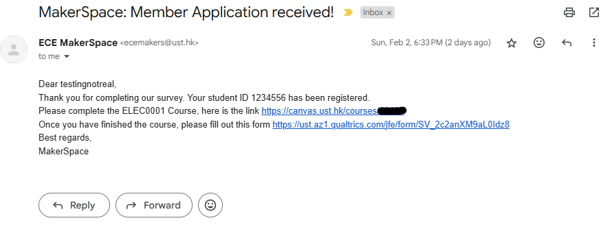
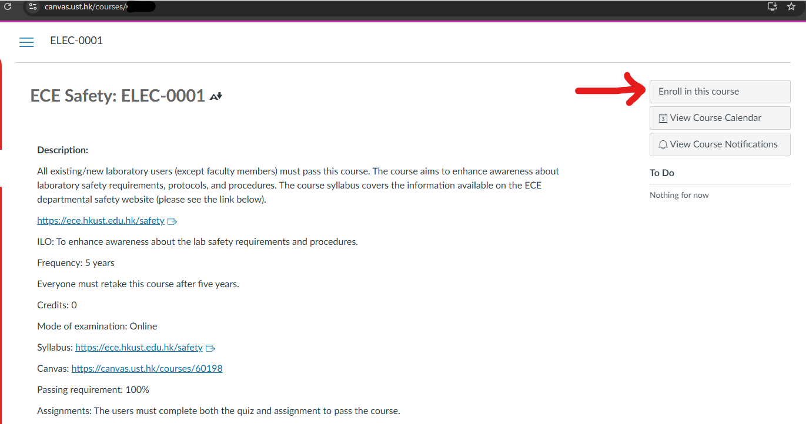

    

        

        

            
        

    

## Canvas Enrollment Guide

Thank you for applying for a makerspace membership, we are so excited to have you join us. In order to get started, you will need to enroll in the Canvas course ELEC0001, so that you can access our labs and equipment. This guide will walk you through the process of enrolling in the course.

## Who is this guide for?
This guide is for students who have already applied for a makerspace membership and have recieved a confirmation email from us, however get **QUIZ LOCKED** when attempting to complete the quiz.

### Step 0:
Maker sure you already recieved a confirmation email of us receiving your application. It may look like this:

### Step 1:
Click on the canvas link, once on the page click on the top right corner on the "Enroll in Course" button.

It may look like this:

**Congratulations, you have enrolled in the course**

if you still have any issues, even after following this guide, please contact us at 
ecemakers(at)ust(dot)hk

_this guide was written on 4th Feb_
_by Kik_