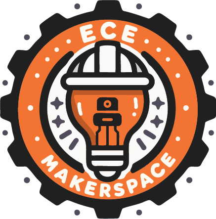

    

        

        

            
        

    

    
    <h1 class="title">ECE MakerSpace Docs</h1>
    
<i>For all things makerspace</i>

    
<a href="https://maker.ece.hkust.edu.hk">Main Website</a>

